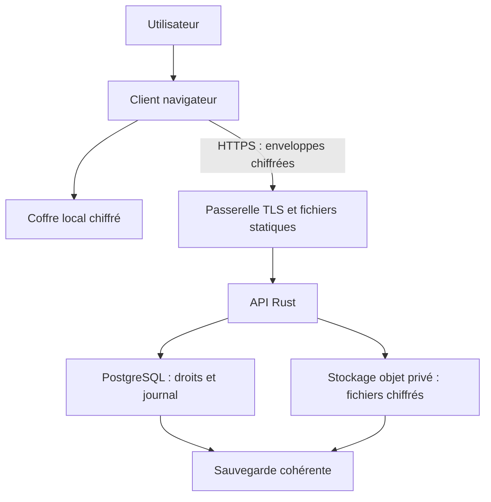
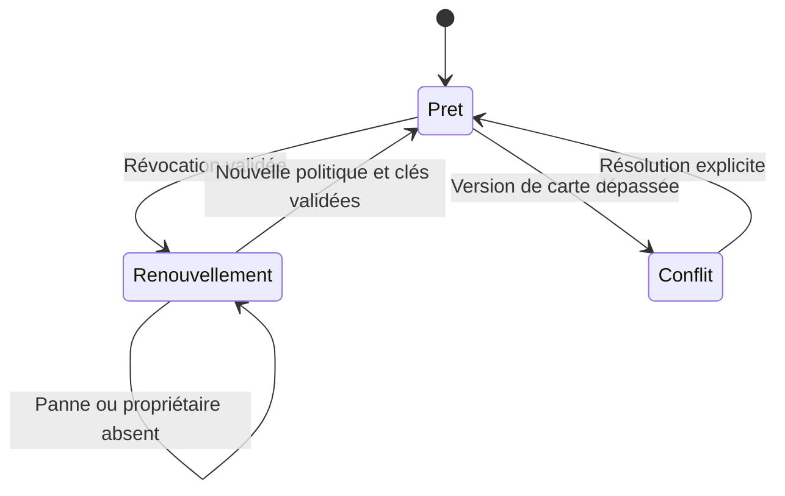

# FrameUp — Architecture technique et registre ADR

> Remplacement partiel au 18 septembre 2026 — [ADR-016, révision 0.2](ADR-016_Application_mobile.md) : l’exclusion du mobile est remplacée à l’échelle du produit. La validation initiale J0-Web reste limitée au desktop. Route mobile et entrée au pilote restent conditionnelles ; la [matrice mobile](Matrice_J0_mobile.md) est un backlog, pas un chantier lancé.

Version 0.1 · 17 septembre 2026 · Proposition préparatoire au POC

Responsable de décision proposé : Clément Jonckheere. Revue technique et cryptographique : à organiser. Aucun choix n'est présenté comme audité, implémenté ou approuvé par une équipe externe.

## 1. Comment utiliser ce document

La documentation d'architecture décrit le système, ses frontières de confiance, ses flux et ses contraintes. Un ADR (Architecture Decision Record) conserve le raisonnement d'une décision : contexte, choix, alternatives et conséquences. Ce document réunit ces deux niveaux pour préparer le POC.

Référence fonctionnelle : `FrameUp_Prototype_Specification_v0.1.md`, datée du 16 septembre 2026, notamment D01–D10 et les scénarios T01–T36. La présente version précise une architecture candidate et des critères de passage ; elle ne modifie pas silencieusement le périmètre du prototype. Les règles d'accès, d'historique complet et de récupération viennent de cette proposition et restent soumises à validation produit.

Statuts utilisés : **Proposé** (choix de travail), **Expérimental** (hypothèse dont la faisabilité doit être démontrée), **Accepté** (après décision explicite enregistrée), **Remplacé** (un nouvel ADR conserve le lien). Aucune entrée de ce registre n'est encore au statut Accepté.

Le POC doit éprouver les décisions risquées avant la construction de toutes les interfaces. La charte graphique décrit la cible visuelle ; elle ne constitue pas un critère préalable à la preuve cryptographique.

## 2. Objectif et périmètre

FrameUp propose un espace de projet confidentiel pour petites équipes et collaborateurs externes. Dans un même projet, une discussion peut devenir une tâche, accompagnée de documents et d'une échéance. Tous les membres partagent la même audience de lecture.

Dans le prototype : trois rôles (propriétaire, contributeur, lecteur), un fil de discussion, un tableau Kanban simple, fichiers chiffrés, échéances dans les cartes, deux appareils maximum par compte pour les essais, récupération et travail temporairement hors connexion.

Reportés : appels, calendrier complet, permissions par carte, sous-groupes privés, bots et automatisations, notifications push externes, édition collaborative de texte, messages éphémères, effacement irréversible et transfert de propriété. Le propriétaire unique ne peut pas quitter son projet ; sa disponibilité conditionne les changements de groupe.

Dimensionnement d'essai : 10 comptes, 20 appareils, 100 cartes, 5 000 événements et 50 fichiers de 10 Mio maximum. Ce sont des charges de test proposées, pas une capacité de production certifiée.

## 3. Architecture cible du prototype

Le client est le seul composant qui traite le contenu en clair. Le code client reste distribué par l'instance : la confiance dans sa chaîne de publication est une limite explicite, même lorsque le stockage est chiffré.

| Composant | Responsabilité | Ce qu'il ne doit pas faire |
|---|---|---|
| Client React/Next.js exporté statiquement | Interface, coffre, chiffrement, déchiffrement, vérification des politiques, recherche locale, brouillons. | Envoyer du contenu lisible dans une route serveur, une URL ou une télémétrie. |
| Module cryptographique dans le navigateur | État de groupe par appareil, enveloppes, signatures et clés. | Inventer un protocole ou réutiliser un état MLS copié entre appareils. |
| Synchronisation cliente | Contrôle des accès avant envoi, reprise par curseur, conflits et idempotence. | Considérer une notification WebSocket comme une preuve de sauvegarde. |
| Passerelle HTTP/TLS | Distribution des fichiers statiques, reverse proxy REST/WS, limites de requêtes. | Journaliser les jetons, secrets ou corps de requêtes. |
| Rust + Axum (proposition) | Authentification d'appareil, droits, transactions, séquences et transferts. | Recevoir les clés privées de contenu ou examiner les textes déchiffrés. |
| PostgreSQL | Journal durable, projections d'accès, objets opaques et transitions atomiques. | Stocker titres, échéances, noms de fichiers ou clés privées en clair. |
| Stockage compatible S3 | Blobs immuables chiffrés sous identifiants opaques. | Exposer des liens publics ou des noms originaux. |

Aucun Redis, Kafka, moteur de recherche serveur ou microservice crypto dans le POC. Ils ne répondent pas à un besoin démontré du périmètre. Les versions exactes, licences et empreintes des dépendances sont figées à J0 après vérification ; aucun numéro de version n'est supposé validé ici.

### Modules internes proposés

| Client | Backend |
|---|---|
| `identity`, `device-pairing`, `local-vault` | `identity`, `sessions`, `devices` |
| `crypto-adapter`, `policies`, `archive-keys` | `projects`, `memberships`, `policies` |
| `event-verifier`, `sync-engine`, `outbox` | `event-admission`, `journal`, `transitions` |
| `discussion`, `kanban`, `files`, `search` | `blob-transfer`, `recovery-packets`, `health` |

Les objets cryptographiques ont des formats versionnés. Le code métier ne manipule pas directement des primitives dispersées dans les composants React. Un adaptateur expose des opérations testables et permet de changer d'implémentation sans changer les règles produit.

## 4. Données et frontières de confiance

| Classe de données | Visible par l'instance | Protection / justification |
|---|---|---|
| Corps de message, titre et description de carte, échéance | Non | Chiffrement client ; recherche et filtres locaux. |
| Fichier, nom original, type affiché, miniature éventuelle | Non | Chiffrement avant envoi ; aperçu généré localement. |
| Identifiant de compte/appareil/projet, clés publiques | Oui | Authentification, routage et contrôle d'accès. |
| Membres, rôles, appareils admis | Oui | Politique signée vérifiée par les clients ; graphe d'appartenance assumé. |
| Type d'opération, taille, séquence, versions, état archivé | Oui | Admission, concurrence et reprise ; fuite structurelle documentée. |
| IP pendant la connexion, heure de réception | Oui | Données opérationnelles ; pas de promesse d'anonymat réseau. |
| Clés d'archives et coffre de récupération | Uniquement chiffrés | L'instance ne doit pas pouvoir les ouvrir. |
| Index de recherche et brouillons | Non | Stockage local chiffré ; brouillons non inclus dans la sauvegarde distante initiale. |

Les projections SQL de rôle sont un accélérateur opérationnel, pas l'unique autorité de confiance du client. Une politique propriétaire signée permet de vérifier les changements. Le serveur garde néanmoins un pouvoir de disponibilité, de séquencement et d'observation des métadonnées.

La protection contre une modification de ciphertext est visée. La détection universelle d'une présentation de vues divergentes à des clients isolés ne l'est pas : signatures et checkpoints locaux ne suffisent pas à assurer une transparence globale. Un serveur malveillant servant du JavaScript modifié est également hors garantie de confidentialité de cette version web. [Sécurité WebCrypto](https://www.w3.org/TR/webcrypto/#security-considerations)

## 5. Flux structurants

### Publier une modification

Le client actualise la politique et l'état de groupe, valide son rôle, chiffre la charge utile et signe l'enveloppe. L'en-tête authentifié lie notamment l'instance, le projet, l'objet, l'événement, l'appareil, la génération de compte, la version de politique, l'époque et la version de base.

Le serveur revérifie la session et les droits courants, puis vérifie la signature, l'idempotence, les versions et les références de fichiers. La transaction ajoute l'événement et actualise la projection d'objet. La réponse confirme le commit. Le WebSocket ne fait qu'annoncer un changement disponible ; le journal REST demeure la source de reprise.

Le client destinataire vérifie politique, signature et contexte avant déchiffrement/application. Une opération sémantiquement invalide est mise en quarantaine avec un état explicite ; le serveur ne peut pas valider le contenu métier chiffré. Un membre hostile peut donc perturber la disponibilité : ce risque n'est pas résolu par le chiffrement.

### Retirer un membre

Ce diagramme décrit le traitement des écritures, pas le cycle de vie complet du projet. `content_state` (actif/archivé) et `security_state` (prêt/renouvellement requis) restent indépendants.

Le seuil T0 est la validation transactionnelle de la révocation. Après T0, aucune nouvelle écriture sous l'ancien état n'est acceptée. Le membre retiré perd ses accès serveur ; les autres membres attendent la rotation pour publier. Un brouillon local préparé sans connaissance de T0 ne reçoit pas une autorisation rétroactive.

### Restaurer un compte

Le kit ouvre localement le coffre d'identité. Une preuve de possession permet d'incrémenter la génération du compte et d'invalider les anciens appareils. La récupération d'archives est séparée de l'admission aux groupes courants. Les états MLS périmés ne sont pas restaurés comme sessions actives ; de nouvelles clés d'appareil et une nouvelle admission sont nécessaires.

Si l'utilisateur avait été exclu d'un projet, la récupération ne rétablit pas son appartenance. Si le propriétaire récupère son compte, il doit pouvoir rétablir une nouvelle génération de groupe et récupérer les archives à partir d'une sauvegarde ou d'un autre membre. La récupération reste partielle si les clés ou les fichiers correspondants n'existent plus.

## 6. Modèle de données et contrats

Les entités minimales sont : `accounts`, `devices`, `projects`, `memberships`, `project_devices`, `policies`, `invitations`, `group_transitions`, `objects`, `events`, `blobs`, `recovery_packets` et `recovery_identity_vaults`.

Contraintes structurantes : unicité `(project_id, event_id)` et `(project_id, sequence)` ; politique versionnée avec lien à la précédente ; version d'objet monotone ; état d'upload distinct de la publication ; paquets de récupération immuables par appareil ; génération de compte vérifiée sur chaque action protégée.

Le contrat HTTP est décrit en OpenAPI avant implémentation complète. Il distingue erreurs d'accès (403), concurrence/époque/transition (409) et enveloppe invalide (422). Un utilisateur non autorisé ne reçoit ni reçu détaillé ni confirmation d'existence d'un projet. Les réponses d'erreur portent un code stable et une explication locale côté interface, jamais le contenu chiffré dans les logs.

| Invariant | Contrôle et preuve attendue |
|---|---|
| I01 : le rôle lecteur n'autorise aucune écriture métier | Contrôle API et vérification cliente ; T02/T03. |
| I02 : aucun nouvel accès après révocation | Générations et appartenance courantes ; T09/T12/T27. |
| I03 : aucune nouvelle publication sous un ancien secret après T0 | Verrouillage et transition obligatoire ; T10/T11/T28/T33. |
| I04 : une répétition n'ajoute pas un second événement | Identifiant stable et comparaison des octets ; T17/T18. |
| I05 : une ancienne base n'écrase pas une carte récente | Comparaison de version et résolution explicite ; T14/T15/T16. |
| I06 : les contenus et secrets ne transitent pas en clair côté serveur | Tests canaris et inspection ; T20/T30. |
| I07 : identité restaurée ne signifie pas tous droits restaurés | Réadmission distincte ; T23/T26/T27. |

## 7. Registre des ADR

### ADR-001 — Monolithe modulaire Rust

**Statut : Proposé.**

**Contexte.** Le prototype nécessite surtout des transactions cohérentes entre rôles, générations, objets et événements. L'équipe et le volume initiaux ne justifient pas des déploiements distribués.

**Décision.** Un backend Rust avec Axum, découpé en modules internes, une base PostgreSQL et un stockage de blobs séparé. REST et WebSocket partagent les mêmes contrôles d'accès. La maîtrise d'Axum doit être vérifiée pendant le socle initial ; ce choix ne prouve aucune sécurité cryptographique.

**Alternatives.** Microservices rejetés pour le coût opérationnel ; FastAPI viable si la maîtrise de Rust retarde nettement les invariants ; Actix-web reste une alternative sans incidence produit.

**Conséquences.** Transactions simples et déploiement unique ; montée en compétence Rust et frontières de modules à surveiller.

**Validation / révision.** Admission concurrente, panne avant/après commit et reprise testées. Réexaminer si une contrainte indépendante de disponibilité ou de charge exige une séparation.

### ADR-002 — Client Next.js statique, contenu exclusivement côté navigateur

**Statut : Proposé.**

**Contexte.** Le contenu déchiffré ne doit pas rejoindre un serveur de rendu ou une action distante.

**Décision.** React/Next.js avec export statique, sans Server Actions ni chargement serveur des contenus privés. Entrées d'application fixes ; identifiants opaques de projet gérés côté client, sans route dynamique exigeant une génération serveur. Aucun secret dans le chemin ou la query string. Police et assets servis par l'instance, sans CDN tiers.

**Alternatives.** React/Vite réduirait la complexité si Next.js n'apporte rien au projet ; SSR des espaces privés rejeté pour ce POC. Client natif reporté.

**Conséquences.** Hébergement simple ; fonctions serveur de Next.js inutilisées. Un export statique a des limitations de routage et de fonctionnalités à vérifier explicitement. [Documentation Next.js](https://nextjs.org/docs/app/guides/static-exports)

**Validation / révision.** Rechargement direct d'un projet, absence de requêtes tierces et absence de contenus canaris dans les réponses statiques. Réexaminer Next.js si l'adaptation dépasse l'intérêt du framework.

### ADR-003 — MLS comme candidat, intégration cryptographique conditionnelle

**Statut : Expérimental, bloquant J0.**

**Contexte.** Ajouter et retirer des appareils nécessite un protocole de groupe éprouvé. Chiffrer avec une bibliothèque de primitives ne résout pas le cycle de vie.

**Décision.** Évaluer une implémentation existante de MLS, notamment OpenMLS, dans les navigateurs cibles. Le protocole s'exécute sur les terminaux ; le serveur ne devient pas un membre du groupe détenant les clés. Aucun protocole de groupe maison en repli silencieux.

**Alternatives.** Autre implémentation MLS, client installé si le navigateur est bloquant, révision du périmètre. Une clé globale immuable partagée à tout le projet est rejetée.

**Conséquences.** Besoin d'un adaptateur WASM ou équivalent validé, persistance d'état et traitement des admissions hors ligne. MLS ne définit pas la politique métier d'identité et d'historique. [RFC 9420](https://www.rfc-editor.org/rfc/rfc9420.html), [OpenMLS](https://github.com/openmls/openmls)

**Validation / révision.** Deux navigateurs réels : création, ajout, retrait, redémarrage, reprise et test de déchiffrement négatif. Si cela échoue, réviser cet ADR avant d'étendre l'application.

### ADR-004 — Audience unique et trois rôles par projet

**Statut : Proposé.**

**Contexte.** Les permissions par carte multiplient les frontières cryptographiques et les erreurs d'audience.

**Décision.** Tous les membres lisent tout le contenu conservé du projet. Propriétaire, contributeur et lecteur limitent les actions. Un sujet restreint exige un autre projet. Les transformations message→tâche restent dans le même projet.

**Alternatives.** ACL par objet et canaux privés reportés. Rôle unique rejeté pour l'accès client en lecture seule.

**Conséquences.** Modèle simple ; un lecteur peut copier ce qu'il lit. Propriétaire unique : pas de départ ni de transfert dans la version initiale.

**Validation / révision.** T01–T08 et essai de compréhension de l'audience. Réexaminer après des usages montrant un besoin fréquent de sous-groupes.

### ADR-005 — Identité stable, appareils séparés et politiques signées

**Statut : Expérimental pour les formats ; règles proposées.**

**Contexte.** L'inscription pseudonyme doit coexister avec une vérification humaine et une révocation d'appareil.

**Décision.** Identité publique stable du compte, clés propres à chaque appareil, génération de compte pour la récupération et politiques de projet signées. Défis d'authentification à usage unique liés à l'origine. Vérification initiale d'empreinte via un canal déjà authentifié. Les appareils n'accèdent à un groupe qu'après admission explicite.

**Alternatives.** Email obligatoire, clé privée identique copiée sur tous les appareils ou confiance exclusive dans l'annuaire serveur rejetés pour le périmètre.

**Conséquences.** L'appairage et les délégations doivent être documentés ; un appareil compromis peut agir tant que sa révocation n'est pas connue. Pas de promesse de transparence globale de l'annuaire.

**Validation / révision.** T03–T06/T22/T23 ; revue du format des certificats, des expirations et de l'invalidation des chaînes.

### ADR-006 — Archives durables séparées des états de communication

**Statut : Expérimental pour la composition ; règle d'historique proposée.**

**Contexte.** Le travail collaboratif demande de relire le passé et d'ajouter un appareil. La conservation de clés d'archives modifie les garanties en cas de compromission future.

**Décision.** Historique complet pour les membres admis ; clés d'archives de période conservées ; clé de contenu distincte par événement/version/fichier. Après retrait, nouvelle clé d'archives et nouvelles clés pour les nouvelles versions. Pas de réutilisation d'une clé de fichier connue d'un exclu.

**Alternatives.** Aucun historique pour les nouveaux membres rejeté pour l'expérience cible ; historique sélectif reporté ; messages éphémères exclus du premier POC.

**Conséquences.** Les archives sont récupérables mais leurs clés exposent les contenus correspondants si elles sont compromises. Une ancienne copie n'est jamais effacée à distance. Une réinvitation rétablit aussi l'accès à la période d'absence.

**Validation / révision.** T07/T11/T25/T35 et revue de séparation clés de session/archives/sauvegarde. Aucun format crypto inédit sans examen dédié.

### ADR-007 — Journal durable REST et WebSocket indicatif

**Statut : Proposé.**

**Contexte.** Les connexions et accusés de réception peuvent être perdus ou répétés.

**Décision.** Journal PostgreSQL ordonné, reprise REST par curseur et WebSocket pour notifier les nouveautés. ID d'événement stable pour un envoi identique ; changement d'octets sous le même ID refusé. Vérification des droits avant restitution d'un reçu.

**Alternatives.** WebSocket comme seule source de vérité rejeté ; bus externe non nécessaire au pilote.

**Conséquences.** Convergence sous hypothèse de serveur ordonnant correctement ; pas de promesse générale d'exécution exactement une fois pour tous les effets externes. Une nouvelle enveloppe après conflit possède un nouvel ID.

**Validation / révision.** T17–T19/T21 ; provoquer perte de réponse, duplication et reconnexion.

### ADR-008 — Concurrence optimiste et conflits visibles, sans CRDT initial

**Statut : Proposé.**

**Contexte.** La modification d'une carte n'est pas une édition de texte simultanée continue.

**Décision.** Version entière par carte ; première modification acceptée, seconde en conflit si sa base est dépassée, même si les champs diffèrent. Interface côte à côte et résolution explicite. Les messages sont des ajouts immuables.

**Alternatives.** Dernière écriture gagnante rejetée pour la perte silencieuse ; CRDT/OT reportés jusqu'à besoin démontré.

**Conséquences.** Mise en œuvre vérifiable ; davantage de conflits pour des équipes très actives. Ne pas transformer un bouton « Réessayer » en écrasement automatique.

**Validation / révision.** T14–T16 et validation utilisateur de l'écran. Réexaminer si la fréquence mesurée de conflits dégrade le travail quotidien.

### ADR-009 — Révocation transactionnelle et arrêt des écritures

**Statut : Proposé.**

**Contexte.** Bloquer une API ne retire pas une clé déjà connue. Une rotation incomplète ne doit pas laisser publier sous l'ancienne clé.

**Décision.** À T0, accès concernés invalidés et `security_state=REKEY_REQUIRED`. Nouvelles publications suspendues jusqu'à la transition signée. Tout appareil encore autorisé actualise son état avant de rechiffrer un brouillon.

**Alternatives.** Rotation en arrière-plan sans blocage rejetée pour la fenêtre de divulgation ; relecture seule est le repli en cas de panne.

**Conséquences.** Dépendance à la disponibilité du propriétaire ; état de sécurité indépendant de l'archivage. Les transactions concurrentes doivent partager une discipline de verrouillage.

**Validation / révision.** T09–T13/T28/T33/T34. Ordre de verrous défini : comptes concernés triés, puis projets triés, puis objets triés ; une lecture/écriture doit prendre les verrous compatibles nécessaires aux générations. Aucun contrôle effectué seulement avant la transaction. Les verrous de lignes PostgreSQL sont un mécanisme possible, à valider sous charge. [Documentation PostgreSQL](https://www.postgresql.org/docs/current/explicit-locking.html)

### ADR-010 — Récupération par kit et nouvelles générations

**Statut : Expérimental pour l'intégration ; règle produit proposée.**

**Contexte.** Perdre tous les appareils ne doit pas permettre à l'administrateur de contourner le chiffrement.

**Décision.** Kit personnel aléatoire, coffre d'identité chiffré, paquets d'archives par appareil, génération de compte renouvelée après preuve. Secrets de récupération racine séparés des clés quotidiennes ; l'appareil quotidien ne peut pas rouvrir l'autorité de récupération. Les anciens états MLS ne sont pas réactivés.

**Alternatives.** Reset email restituant les données et séquestre de clé administrateur exclus ; récupération sociale reportée.

**Conséquences.** Sans kit/appareil/sauvegarde nécessaires, récupération impossible ou partielle. Le vol du kit est un incident d'identité plus grave qu'une perte d'appareil. Réadmission des groupes indépendante de la restauration du compte.

**Validation / révision.** T23–T27/T36, y compris récupération du propriétaire et clé d'archive manquante.

### ADR-011 — Coffre local, blobs privés et finalisation autorisée

**Statut : Proposé, formats crypto expérimentaux jusqu'à J0.**

**Contexte.** Un cache hors connexion et un upload interrompu créent des copies hors journal métier.

**Décision.** Coffre local chiffré (cache, index, brouillons), un seul onglet en écriture sur un même état local ; upload chiffré en transit privé puis finalisation transactionnelle. Téléchargement par API avec droits courants. Pas d'URL publique durable. Orphelins nettoyés après 24 h.

**Alternatives.** `localStorage` en clair rejeté ; recherche serveur du contenu et analyse antivirus serveur en clair incompatibles avec cette architecture.

**Conséquences.** Limite de 10 Mio par fichier pour les essais ; recherche locale et prévisualisation doivent être dimensionnées. Verrouillage applicatif à 10 min avec préavis ; purge mémoire JavaScript seulement au mieux.

**Validation / révision.** T20/T21/T29/T30/T32 ; après révocation pendant upload, finalisation refusée, ou nouveau chiffrement si la clé a pu être exposée au groupe précédent.

### ADR-012 — Instance pilote unique, sauvegardes cohérentes et reprise fermée

**Statut : Proposé.**

**Contexte.** Docker décrit l'emballage, pas qui exploite le service ni sa disponibilité.

**Décision.** Une instance pilote exploitée par l'équipe du prototype, Compose sur un hôte, volumes persistants, TLS, réseaux privés pour DB/stockage et secrets hors images. Images figées et déploiements issus d'un build vérifié. Sauvegardes coordonnées DB/blobs quotidiennes, conservation 7 jours.

**Alternatives.** Kubernetes et offre multi-instances supportée reportés. Le Compose pourra préparer l'auto-hébergement, sans en promettre le support initial.

**Conséquences.** Pas de haute disponibilité. RPO cible 24 h ; remise en service cible 4 h à mesurer. Une restauration commence sans écritures ni anciennes sessions réactivées ; politiques réconciliées et groupes renouvelés avant réouverture.

**Validation / révision.** T28/T31 ; exercice de restauration incluant une révocation postérieure au snapshot. Réexaminer après exigences de disponibilité explicites.

### ADR-013 — Journalisation minimale et protection du code distribué

**Statut : Proposé.**

**Contexte.** Contenus, invitations ou métadonnées peuvent fuir dans les erreurs, dépendances et proxys.

**Décision.** Aucune analytique tierce ni police externe ; CSP stricte, politique de référent restrictive, contrôle d'origine des connexions et protections CSRF si session par cookie. Évaluer `HttpOnly`, `Secure`, `SameSite` avec les flux d'authentification retenus. Logs sans corps, jeton, clé ou identifiant utilisateur ; diagnostics minimaux conservés 7 jours ; IP non persistée dans les logs d'exploitation usuels du pilote.

**Alternatives.** Session replay et SDK d'erreurs capturant automatiquement le contexte rejetés. Diagnostic local expurgé déclenché par l'utilisateur possible ultérieurement.

**Conséquences.** Débogage moins riche. Une CSP et un build reproductible ne protègent pas seuls d'un opérateur distribuant un client malveillant ; documentation honnête de cette limite.

**Validation / révision.** T30, inspection du navigateur et du proxy, test de contenu injecté et dépendances figées. Modifier les règles seulement via ADR avec données collectées et durées explicites.

### ADR-014 — Gates de qualité avant extension fonctionnelle

**Statut : Proposé.**

**Contexte.** Une interface fonctionnelle ne démontre pas une propriété de sécurité.

**Décision.** J0 valide la faisabilité réelle de la chaîne crypto ; J1 les accès ; J2 le parcours contenu ; J3 les conflits ; J4 récupération et pannes ; J5 l'utilisabilité. Tests unitaires des règles, intégration transactionnelle et navigateurs réels. Les tests cryptographiques négatifs utilisent la bibliothèque réelle, pas un mock.

**Alternatives.** Construire toutes les vues avant le cycle des clés rejeté pour le risque de refonte.

**Conséquences.** Progression moins visuelle au début mais incertitudes majeures traitées tôt. Aucune échéance de production avancée sans résultats du POC.

**Validation / révision.** Traçabilité I01–I07 vers T01–T36 ; rapport avec versions, environnement, résultat et limites. Revue indépendante avant données sensibles.

### ADR-015 — Système visuel sobre et états métier explicites

**Statut : Proposé.**

**Contexte.** Un utilisateur doit distinguer ce qui est envoyé, sauvegardé, lisible ou bloqué sans comprendre MLS.

**Décision.** Thème clair, navigation bleu nuit, action turquoise, tokens sémantiques séparés pour succès/attention/erreur. État toujours formulé par un texte, jamais par la couleur seule. Synchronisation, sauvegarde et droits ont trois indicateurs distincts. Charte associée : `FrameUp_Charte_Graphique_v0.1.md` et aperçu PDF.

**Alternatives.** Esthétique « cybersécurité » à cadenas omniprésents, thème sombre uniquement et jargon cryptographique dans le flux principal écartés pour la lisibilité.

**Conséquences.** L'accessibilité requiert des tests de composants, pas uniquement de bons contrastes. Le glisser-déposer doit avoir une alternative clavier et menu.

**Validation / révision.** Contrastes calculés des couples spécifiés, navigation clavier, annonces de statut, zoom/reflow et récupération compréhensible. WCAG 2.2 AA est une cible, pas une conformité déjà établie. [WCAG 2.2](https://www.w3.org/TR/WCAG22/)

## 8. Décisions ouvertes et critères de sortie du cadrage

| Question à trancher | Responsable proposé | Quand / preuve |
|---|---|---|
| Bibliothèque MLS, provider crypto et compatibilité navigateur | Développement + revue spécialisée | J0 : exécution sur Chromium/Firefox, état persistant et retrait vérifiés. |
| Formats d'identité, certificats, enveloppes et clés d'archives | Revue spécialisée + développement | J0 : formats versionnés, invariants et tests négatifs. |
| Coût réel de Rust/Next.js dans l'équipe | Responsable projet | J0/J1 : un parcours vertical fonctionnel et maintenable. |
| Paramètres du coffre local et budget mémoire | Développement | J0 : mesures sur matériels cibles, sans blocage excessif de l'interface. |
| Direction graphique et concept de marque | Clément | Relecture de la charte et du PDF ; ne bloque pas les essais crypto. |
| Besoin d'un second administrateur / transfert de propriété | Produit | Après entretiens pilote ; actuellement hors périmètre. |

L'acceptation d'un ADR ajoute date, décisionnaire et preuves. Une évolution significative crée un nouvel ADR qui remplace l'ancien ; elle ne réécrit pas l'historique du raisonnement. Le registre sera découpé en fichiers `docs/adr/0001-...md` lors de la création du dépôt.

## 9. Sources techniques consultées

- [MLS, RFC 9420](https://www.rfc-editor.org/rfc/rfc9420.html) : protocole de groupe et limites de son périmètre applicatif.
- [OpenMLS](https://github.com/openmls/openmls) : candidat d'implémentation à vérifier, pas garantie de compatibilité présumée.
- [Next.js : export statique](https://nextjs.org/docs/app/guides/static-exports) : capacités et limitations de distribution du client.
- [PostgreSQL : verrous explicites](https://www.postgresql.org/docs/current/explicit-locking.html) : mécanismes transactionnels proposés.
- [WebCrypto : sécurité](https://www.w3.org/TR/webcrypto/#security-considerations) : limites du contexte navigateur.
- [WCAG 2.2](https://www.w3.org/TR/WCAG22/) : objectifs d'accessibilité de l'interface.

Les politiques d'historique, les délais, la palette, les rôles et le dimensionnement sont des propositions FrameUp, non des obligations issues de ces sources.
